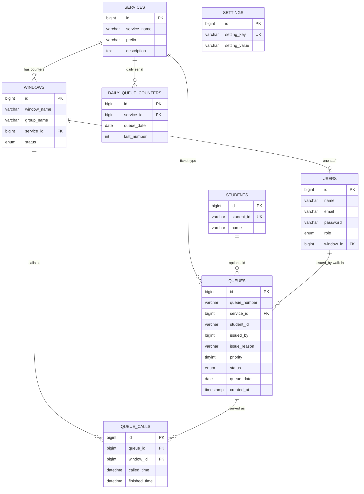
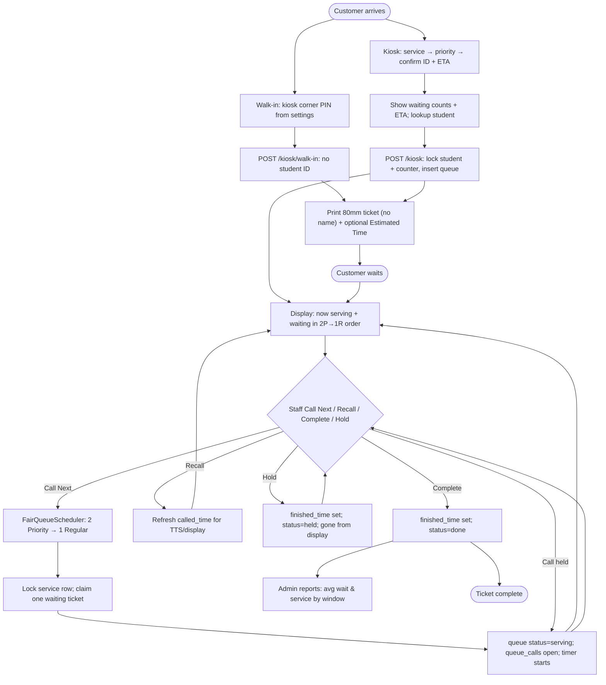

# PECIT Queuing System

Queue management system for **Philippine Electronics and Communication Institute of Technology Inc. (PECIT)** — capstone research project.

Customers take a ticket from a public **kiosk** after entering a Student ID on confirm. People who cannot use the kiosk (new enrollees, no record) get a **walk-in ticket** from the kiosk PIN (no Guard login). Staff call numbers at service windows (and can Hold a ticket). A public **display** shows who is being served — numbers only, no names. **Admins** manage users, the kiosk PIN, history, and reports.

**Stack:** Laravel 12 · Blade · Vite/Tailwind · MySQL/MariaDB (typical **XAMPP** on Windows)

---

## What the system does

| Module | Access | Purpose |
|--------|--------|---------|
| **Kiosk** | Public | 3-step ticket: service → priority → confirm (Student ID + live wait estimate) → 80mm print. Tiny corner button + PIN issues walk-ins. |
| **Display** | Public | Now serving (by window group) + waiting list in call order + optional voice (no names, no held) |
| **Staff window** | Staff login | Call Next (fair 2P→1R), Recall, Complete, Hold; per-counter service timer; student name while serving |
| **Staff float** | Staff | Small always-on-top Windows panel for the same actions (incl. Hold) |
| **Walk-in** | Kiosk PIN (admin can also issue) | No Student ID; for new enrollees / no record / other. Guard accounts cannot log in. |
| **Admin** | Admin login | Live dashboard, users, kiosk PIN, students (CSV), walk-in issue, history, tickets, wait/service reports |

- Tickets stay **anonymous on print and the public display** (no student name). The kiosk confirm step requires a **Student ID**.
- One student may have only **one open ticket per day** (waiting, serving, or held), across all services.
- **Walk-in tickets**: kiosk corner PIN (Admin → **Kiosk PIN**, stored in `settings`); no Student ID, many at once; staff sees “Walk-in (reason)”; print/display stay number-only. There is no Guard login.
- Demo IDs in the dump: `2024-0001` Juan Dela Cruz, `2024-0002` Maria Santos, `2024-0003` Jose Rizal, `2024-0004` Ana Reyes, `2024-0005` Pedro Garcia.
- Staff can **Hold** (set aside) the current ticket, then **Call** it later without waiting in the 2P→1R line.
- Priority is **Regular** or **Priority** only.
- Calling uses shared **2 Priority → 1 Regular** per service (Cashier 1 / 2 / 3 share one Cashier queue).
- Each counter has its own **service timer**; Complete on one window never affects another.
- Estimated wait uses active counters + history; the thermal ticket may add one line: `Estimated Time: N minutes`.
- Kiosk UI is **finalized** — do not redesign it casually (print sizing / ETA line / confirm Student ID keypad / tiny walk-in PIN button / small PECIT seal in the title row are allowed exceptions).
- Login / staff / admin use the **PECIT** navy/gold theme (local fonts + SVG icons, no CDN).
- Thermal tickets target **XP-58(XP-Q90EC)** (80mm).
- Secret **About / capstone credits** page: press **Ctrl + Alt + Shift + A** (not in menus).

---

## How to run (XAMPP)

### 1. Prerequisites

- XAMPP (Apache + MySQL/MariaDB + PHP 8.2+)
- Composer
- Node.js / npm
- Google Chrome (for silent kiosk print and staff float)

### 2. Place the project

Example path:

```text
C:\xampp\htdocs\queue-system
```

### 3. Create the database

1. Start **Apache** and **MySQL** in XAMPP Control Panel.
2. Open phpMyAdmin → create database: `queuing_system`
3. Import the SQL dump:

```text
queuing_system.sql
```

(Or import via command line:)

```bash
mysql -u root -p queuing_system < queuing_system.sql
```

### 4. Configure `.env`

```bash
copy .env.example .env
```

Set at least:

```env
APP_NAME="PECIT Queuing System"
APP_URL=http://localhost/queue-system/public

DB_CONNECTION=mysql
DB_HOST=127.0.0.1
DB_PORT=3306
DB_DATABASE=queuing_system
DB_USERNAME=root
DB_PASSWORD=

SESSION_DRIVER=file
CACHE_STORE=file
QUEUE_CONNECTION=sync
```

> The SQL dump focuses on **domain tables**. Using `SESSION_DRIVER=file` and `CACHE_STORE=file` avoids needing Laravel `sessions` / `cache` tables on a fresh dump import.

Then:

```bash
composer install
npm install
npm run build
php artisan key:generate
```

### 5. Open the app

With Apache running, use (adjust if your path differs):

| Page | URL |
|------|-----|
| Kiosk | http://localhost/queue-system/public/kiosk |
| Display | http://localhost/queue-system/public/display |
| Login | http://localhost/queue-system/public/login |
| Staff | http://localhost/queue-system/public/window |
| Admin | http://localhost/queue-system/public/admin |
| About (secret) | http://localhost/queue-system/public/about — or **Ctrl+Alt+Shift+A** |

Optional (PHP built-in server from project root):

```bash
php artisan serve
```

Then open `http://127.0.0.1:8000/kiosk` (and so on).

---

## Users (from `queuing_system.sql`)

Roles: **`admin`** or **`staff`**. Staff must be assigned a **window**; only **one staff account per window**. Walk-in tickets use the **kiosk PIN** (Admin → Kiosk PIN). There is no Guard login.

| Name | Email | Role | Window | Notes |
|------|-------|------|--------|--------|
| Admin | `admin@gmail.com` | admin | — | Password in dump is plain text **`admin`** (login accepts it) |
| rhem | `rhem@gmail.com` | staff | Cashier 1 (`window_id` 1) | Bcrypt hash in dump — reset via Admin → Users if unknown |
| omar | `omar@gmail.com` | staff | Cashier 2 (`window_id` 2) | Bcrypt hash in dump — reset via Admin → Users if unknown |

A `guard` issuer row may exist in the dump for `issued_by` on walk-in tickets. It **cannot log in**. Create or edit admin/staff under **Admin → Users**.

Kiosk IDs are managed under **Admin → Students** (add one, delete, or bulk import a CSV with `student_id,name`). Existing IDs in a CSV are skipped. A student with an open ticket today cannot be deleted.

---

## Database overview

**Database name:** `queuing_system`  
**Canonical dump:** `queuing_system.sql` at the repo root

### Domain tables

| Table | Purpose |
|-------|---------|
| `services` | Service types + ticket prefix (`C`, `P`, `D`, `R`, …) |
| `windows` | Counters; `service_id`, `group_name` (display groups), `status` |
| `users` | `role` = `admin` \| `staff` \| `guard` (issuer only, no login); staff have `window_id` |
| `settings` | Key/value app settings (kiosk walk-in PIN) |
| `daily_queue_counters` | Per-service daily serial for ticket numbers |
| `students` | Allowlisted Student IDs + names for kiosk lookup |
| `queues` | Tickets: number, service, optional `student_id`, optional `issued_by`/`issue_reason` (walk-in), priority (0/1), status (`waiting`/`serving`/`done`/`cancelled`/`held`), date |
| `queue_calls` | Call history: queue ↔ window, called/finished times (service duration) |

### Seeded services & windows (dump)

**Services**

| ID | Name | Prefix |
|----|------|--------|
| 1 | Cashier | C |
| 2 | Promissory Notes | P |
| 3 | Data Management Office | D |
| 4 | Registrar | R |

**Windows**

| ID | Window | Group | Service |
|----|--------|-------|---------|
| 1 | Cashier 1 | Window 1 | Cashier |
| 2 | Cashier 2 | Window 1 | Cashier |
| 3 | Cashier 3 | Window 1 | Cashier |
| 4 | Promissory Notes | Window 2 | Promissory Notes |
| 5 | DMO | Window 3 | DMO |
| 6 | Registrar | Window 4 | Registrar |

Ticket example: Cashier → `C001`, `C002`, …

> Promissory Notes is **hidden on the kiosk** for now, but the service/window still exist for staff/display if needed.

Domain migrations (if aligning an existing DB instead of full import) live under `database/migrations/2026_04_18_*.php`. Details: [AGENTS.md](AGENTS.md).

---

## Day-to-day operation

### Start with Windows

1. Run `bats/install-pecit-startup.bat` once (creates a Startup shortcut).
2. On each login, `bats/start-pecit-on-windows.bat` starts XAMPP Apache/MySQL, waits for the site, then launches the kiosk.
3. To also open the display automatically, edit `bats/start-pecit-on-windows.bat` and set `START_DISPLAY=1`.
4. To dump MySQL at each login (recommended after a corruption scare), run `bats/install-mysql-backup-startup.bat` once. Dumps go to `C:\xampp\mysql\backups` and dated files older than 14 days are deleted.
5. To remove autostart, delete the shortcut(s) in the Windows Startup folder.

See `bats/GUIDE.txt` for every launcher’s purpose.

### Kiosk + silent print (XP-58(XP-Q90EC) / 80mm)

1. Run `bats/start-kiosk-chrome.bat` (or `bats/start-kiosk-edge.bat`) — waits **10 seconds**, sets the printer matching **XP-Q90EC** as Windows default, clears Chrome sticky printer settings, then opens fullscreen kiosk + silent print.
2. If the printer name differs, edit `PRINTER_MATCH` in the `.bat` (do not put parentheses in echoed CMD values).
3. Customers use the 3-step flow; confirm shows currently serving, waiting counts, and estimated wait when history exists.
4. Printed ticket stays compact; when ETA is available it adds one line: `Estimated Time: N minutes`.
5. Close all Chrome/Edge windows first if silent print still shows a dialog.

Edit the URL inside the `.bat` if your local path is different.

### Public display

Open `/display` on the lobby TV/PC (Chrome/Edge recommended for voice).  
Waiting list columns follow the same **call order** as Call Next (2 Priority → 1 Regular), up to 10 rows, sized to fit without scrolling.

### Staff

1. Log in with a staff account → `/window`.
2. Use **Call Next**, **Recall**, **Complete**, **Hold** (or **Alt+N** Next, **Alt+R** Recall, **Alt+C** Complete). Hold sets the ticket aside so you can call someone else; **Call** on the held list brings them back without the 2P→1R wait.
3. Watch the **Service Time** timer for the ticket on *this* counter only.
4. Optional always-on-top panel: click **Open System Float** (runs `bats\start-staff-float.bat` on **this** PC). On each staff PC run `bats\install-staff-float-protocol.bat` once. Other PCs: set `bats\staff-float-url.txt` to the server LAN address, e.g. `http://192.168.2.100/queue-system/public/window/float` (not localhost). Header **moon/sun** toggles dark mode.

### Walk-in tickets (kiosk PIN)

On the kiosk, tap the **tiny square in the bottom-right corner**, enter the walk-in PIN, then issue a ticket (service, priority, reason). Each tap of that button asks for the PIN again (after print or cancel too). There is no Guard login.

Change the PIN under **Admin → Kiosk PIN** (stored in the `settings` table, default `1981`). Admin can still issue walk-ins from **Walk-in Tickets**.

### Admin

Log in as admin → `/admin`:

- **Dashboard** — live totals (today / waiting / serving / completed), quick links, live waiting table; moon/sun in the header toggles dark mode
- **Users** — admin / staff accounts and window assignment
- **Kiosk PIN** — edit the walk-in PIN (database `settings` table)
- **Walk-in Tickets** — issue tickets for people who cannot use the kiosk
- **Served History / All Tickets** — records
- **Reports & Analytics** — overall and **per-window** average waiting time and average service time

### Capstone About page (secret)

- Press **Ctrl + Alt + Shift + A** from kiosk, display, staff, or admin screens.
- Not linked in any sidebar.
- Team roster: edit `config/about.php` (5 members).
- Photos: put files in the **hidden** folder `storage/app/private/about/team/` (not under `public/`).

---

## Diagrams (Mermaid)

GitHub renders these on the README. You can also paste them into [mermaid.live](https://mermaid.live), or open the local viewer at `/flowchart-viewer.html` (offline Mermaid in `public/vendor/mermaid/`). More detail: [docs/system-flowchart.md](docs/system-flowchart.md). Crow’s-foot ERD: [docs/erd/queuing_system.erd](docs/erd/queuing_system.erd) (open in [ERD Designer](https://kajitiluna.github.io/erd-designer) or the `kajitiluna.erd-designer` extension). Interactive Archify maps: [runtime architecture](docs/archify/pecit-runtime.architecture.html) and [ERD](docs/archify/pecit-erd.architecture.html).

### Entity-relationship diagram (ERD)



### System flowchart



---

## Developer notes

```bash
composer install
npm install
npm run build
```

- Kiosk views: `resources/views/kiosk/*` + `layouts/app.blade.php` (**locked UI**)
- Staff/admin/login theme: `layouts/panel.blade.php`, `resources/css/panel.css`
- Icons: `resources/views/partials/icon.blade.php` (inline SVG, offline)
- Fonts: Source Sans 3 bundled into `public/build/` via Vite
- After CSS/JS/font changes: `npm run build`

For AI agents and deeper technical context, see **[AGENTS.md](AGENTS.md)**.
