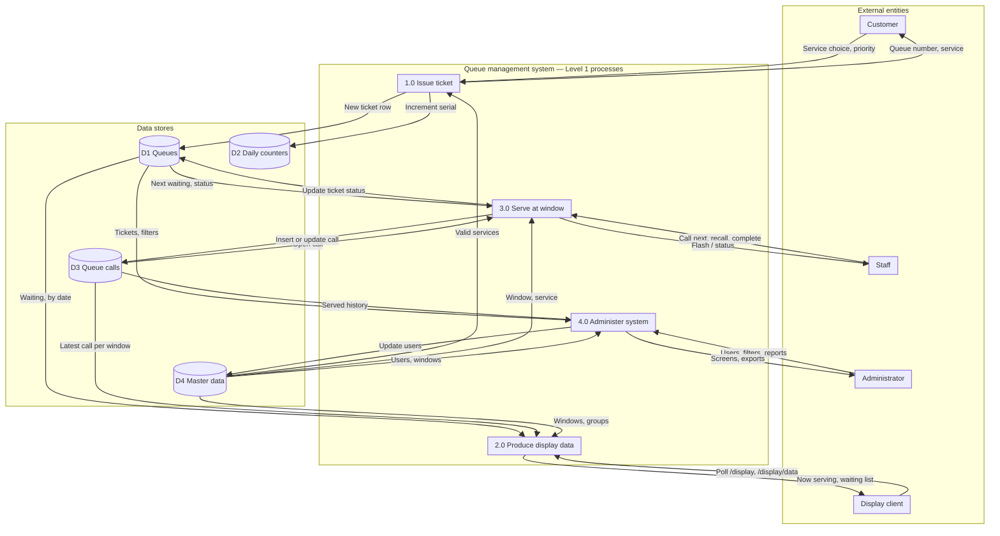

# Level 1 data flow diagram — queue system

**Context:** Physical **system boundary** = the Laravel web application + MySQL used by kiosk, display, staff, and admin.  
**Level 1** decomposes that system into **four major processes**, four **logical data stores**, and **four external entities**.

---

## Diagram (Mermaid)

Paste into [mermaid.live](https://mermaid.live) or open `dfd-level1.mmd`. For printing, export **SVG** and use **Landscape** or **Fit to page**.

### Data store definitions

| ID | Maps to tables (logical) | Contents |
|----|---------------------------|----------|
| **D1** | `queues` | Ticket rows: number, service, priority, status, date |
| **D2** | `daily_queue_counters` | Per service per day: last issued serial |
| **D3** | `queue_calls` | Links queue to window: called / finished times |
| **D4** | `services`, `windows`, `users` | Service prefixes, window groups, accounts |

### Process definitions

| ID | Name | Typical controller / route |
|----|------|------------------------------|
| **1.0** | Issue ticket | `KioskController@store`, `GET /kiosk` |
| **2.0** | Produce display data | `DisplayController@index`, `DisplayController@data` |
| **3.0** | Serve at window | `WindowController` call-next / recall / complete, `GET /window` |
| **4.0** | Administer system | `AdminDashboardController`, `UserManagementController`, `HistoryController` |

### External entities

| Entity | Role |
|--------|------|
| **Customer** | Uses public kiosk; no login |
| **Staff** | Logged-in counter user tied to one window |
| **Administrator** | Full admin routes |
| **Display client** | Browser on TV/monitor; read-only public display |

---

## Level 0 (context) — optional one-page summary

For documentation sets that require a **context diagram**: draw a single process **0.0 Queue management system** with the same four external entities and a single bidirectional “queue data” bundle to MySQL; this Level 1 diagram is the decomposition of **0.0**.

---

*PECIT queue system — aligns with `routes/web.php` and domain tables.*
