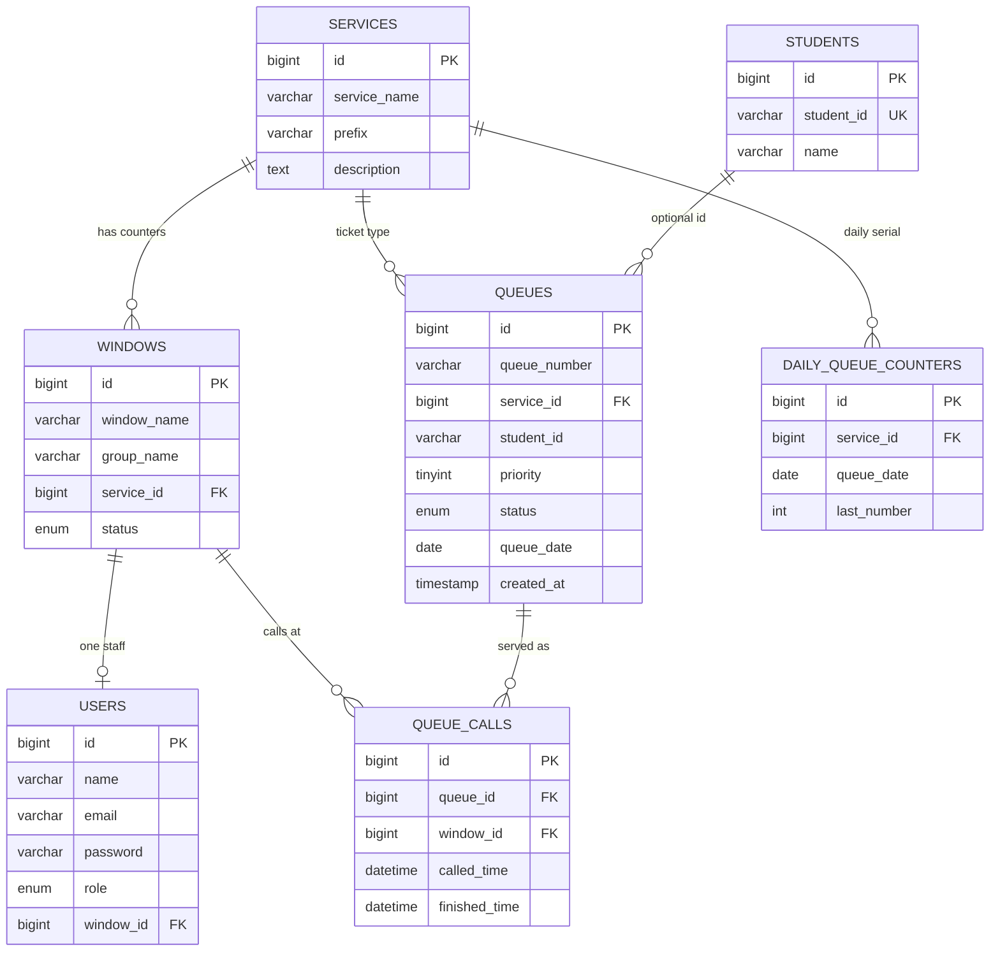

# Entity-relationship diagram (ERD)

Domain tables for the PECIT Queuing System (`queuing_system`).  
Also embedded in [README.md](../README.md). Laravel `migrations` is omitted (framework table, not domain).

**Crow’s-foot ERD (ERD Designer):** [erd/queuing_system.erd](erd/queuing_system.erd) — MariaDB, built with [ERD Designer](https://github.com/kajitiluna/erd-designer). Do not edit the JSON by hand.

Open it in either:

- Browser: [kajitiluna.github.io/erd-designer](https://kajitiluna.github.io/erd-designer) → import `docs/erd/queuing_system.erd` (IndexedDB does not pick up CLI edits automatically; re-import after a rebuild).
- VS Code / Cursor: extension `kajitiluna.erd-designer`.

To rebuild from an empty document (CLI only; requires the `erd-designer` skill CLI): delete `queuing_system.erd`, run `create-document` with `databaseType: mariadb`, then `node docs/erd/_build.cjs`.

Interactive Archify ER map (architecture-style, not crow’s-foot): [archify/pecit-erd.architecture.html](archify/pecit-erd.architecture.html).

## Notes

| Relationship | Meaning |
|--------------|---------|
| Service → Windows | One service can have many counters (e.g. Cashier 1–3) |
| Service → Queues | Shared waiting queue per service |
| Window → User | At most one staff account per window |
| Queue → Queue calls | Call/recall/complete/hold sessions at a window |
| Service → Daily counters | Locked daily ticket serial (`C001`, …) |
| Student → Queues | Optional Student ID on a ticket; name is staff/admin only |
