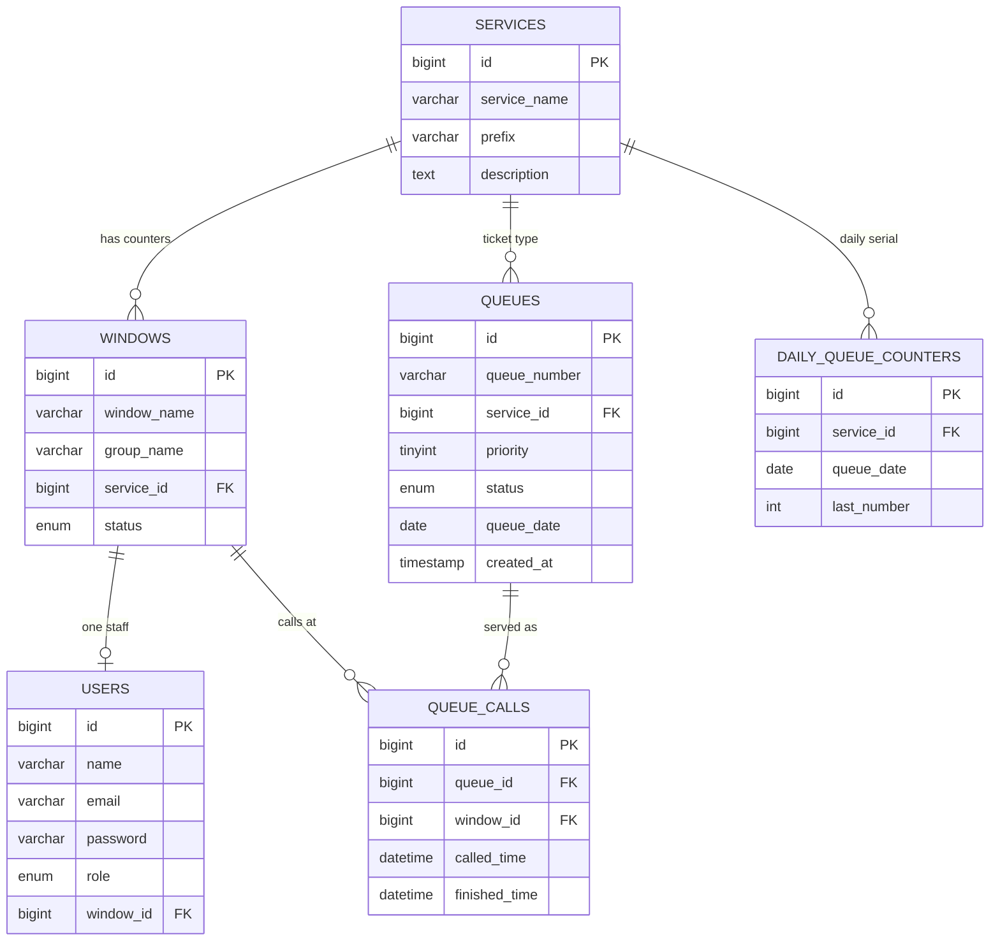

# Entity-relationship diagram (ERD)

Domain tables for the PECIT Queuing System (`queuing_system`).  
Also embedded in [README.md](../README.md).

## Notes

| Relationship | Meaning |
|--------------|---------|
| Service → Windows | One service can have many counters (e.g. Cashier 1–3) |
| Service → Queues | Shared waiting queue per service |
| Window → User | At most one staff account per window |
| Queue → Queue calls | Call/recall/complete sessions at a window |
| Service → Daily counters | Locked daily ticket serial (`C001`, …) |
