# Queue system — detailed system flowcharts

Mermaid diagrams for the **print-only** PECIT queue system (Laravel 12, Blade, MySQL). Student ID is collected on kiosk confirm; names are staff-only.

Interactive Archify architecture map (open in a browser): [docs/archify/pecit-runtime.architecture.html](archify/pecit-runtime.architecture.html).

**View Mermaid in browser:** with `php artisan serve` running, open  
[http://127.0.0.1:8000/flowchart-viewer.html](http://127.0.0.1:8000/flowchart-viewer.html)  
(or `/flowchart-viewer.html` on your app host).  

Also render in **GitHub**, **VS Code** (Mermaid preview), or [mermaid.live](https://mermaid.live) by pasting diagrams from this file.

---

## Table of contents

0. [Master system overview](#0-master-system-overview-similar-style-to-classic-kiosk-flow)
1. [End-to-end context](#1-end-to-end-context)
2. [Kiosk — ticket issuance](#2-kiosk--ticket-issuance)
3. [Public display monitor](#3-public-display-monitor-detailed)
4. [Staff window — counter](#4-staff-window--counter-detailed)
5. [Admin panel](#5-admin-panel-detailed)
6. [Queue lifecycle & shared data](#6-queue-lifecycle--shared-data)
7. [Auth & middleware](#7-auth--middleware)

---

## 0. Master system overview (similar style to classic kiosk flow)

Single end-to-end picture aligned with **this** codebase: **Student ID on confirm**, **print/display stay number-only**, **print-only** (no eco/photo path), **display** + **voice**, **staff** writes to the same tables.

**Printing:** This diagram is **compact** so it fits **Letter/A4 bond paper** when exported from [mermaid.live](https://mermaid.live) (SVG/PNG) or printed: use **Landscape** if needed, or **scale to fit** in the print dialog.

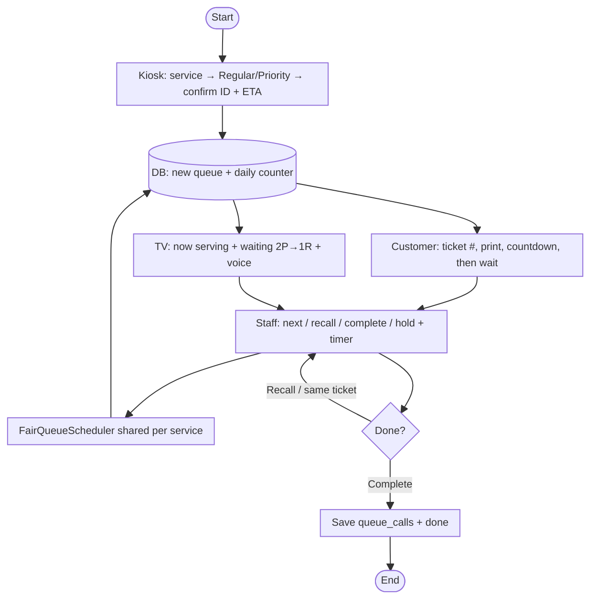

---

## 1. End-to-end context

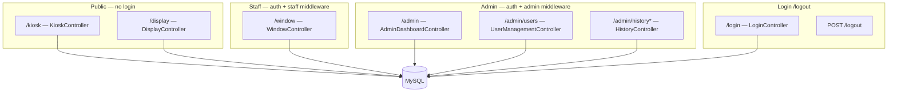

---

## 2. Kiosk — ticket issuance

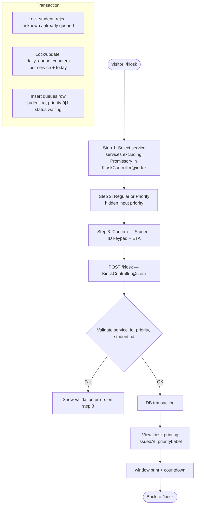

---

## 3. Public display monitor (detailed)

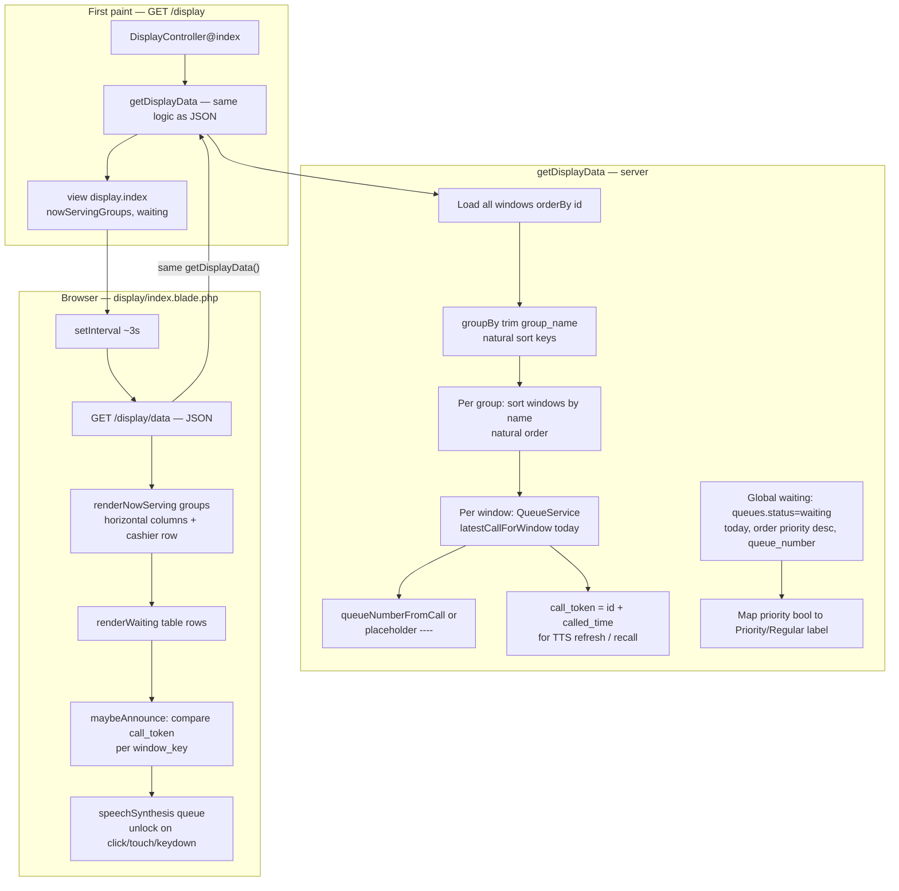

### Display — UI blocks (conceptual)

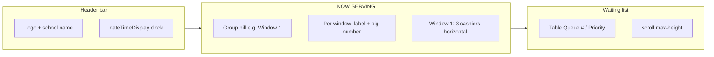

---

## 4. Staff window — counter (detailed)

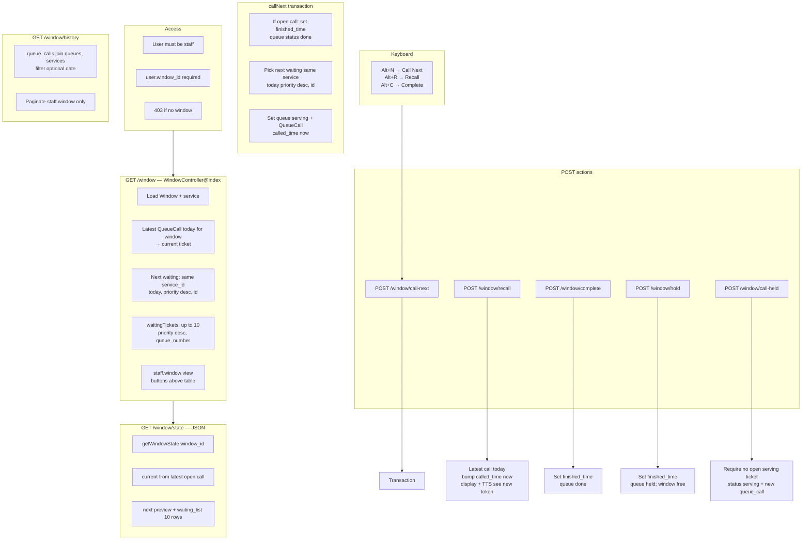

### Staff — action sequence (call next)

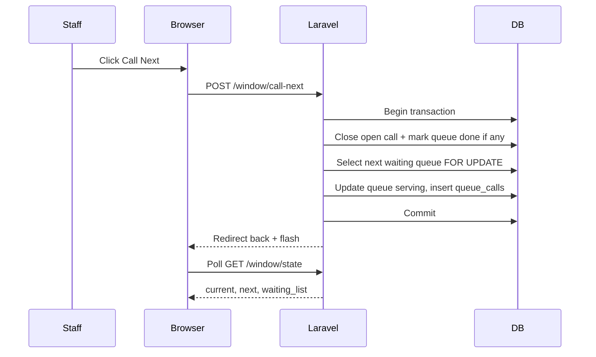

---

## 5. Admin panel (detailed)

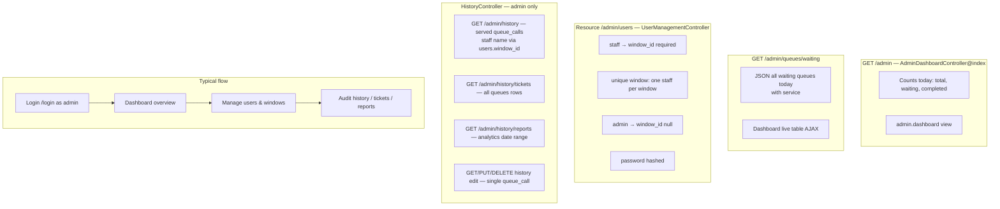

### Admin — history & reports (data sources)

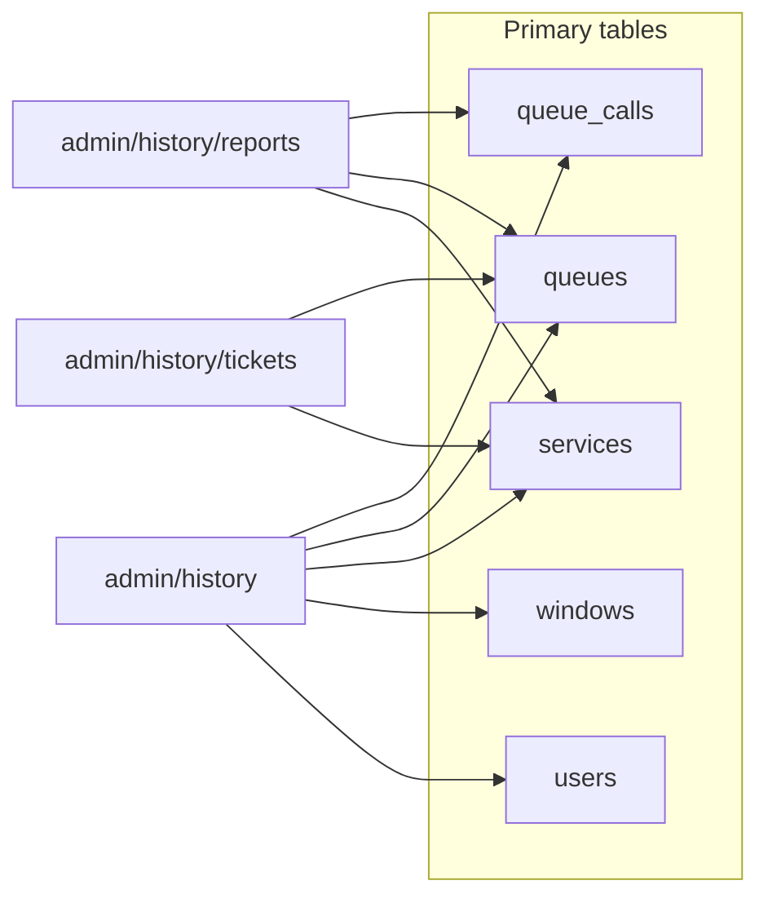

---

## 6. Queue lifecycle & shared data

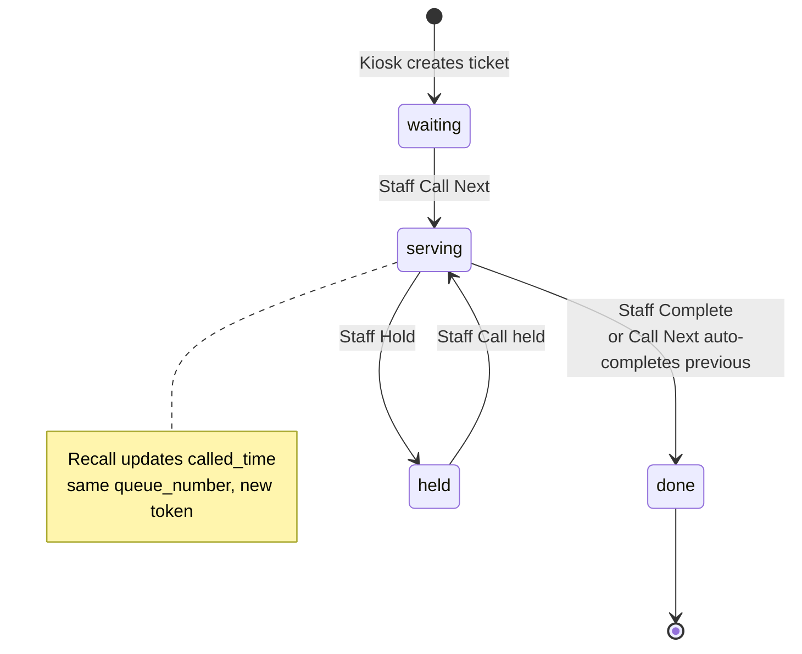

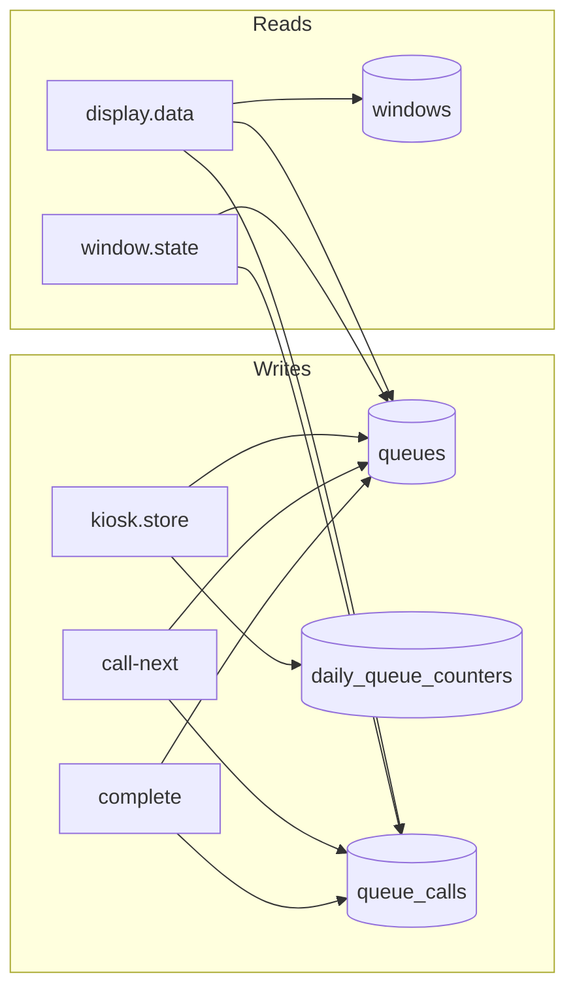

---

## 7. Auth & middleware

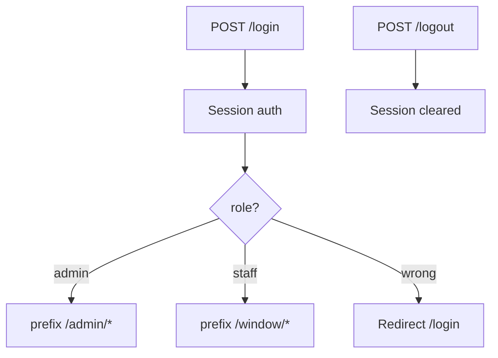

---

*Generated for the PECIT queue system. Routes: `routes/web.php`.*
